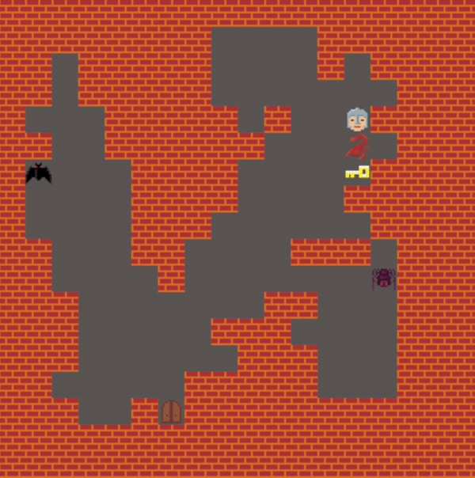

# Zelda AI Game

This is a python implementation of Zelda game environment to showcase the AI techniques in procedural content generation (PCG) and playing the game. For the content generation, we implemented **cellular automata** and **noise and fractal** approaches. We also used the **A-Star** path finding algorithm and **Double Deep Q Network (DDQN)** to solve this game.

## Application

### Cellular Automata Generated Map

<table>
 <tr>
    <td></td>
    <td></td>
 </tr>
 <tr>
    <td></td>
    <td></td>
 </tr>
</table>

### Fractal Noise Generated Map

<table>
 <tr>
    <td></td>
    <td></td>
 </tr>
 <tr>
    <td></td>
    <td></td>
 </tr>
</table>

### A-Star Zelda Solver

<table>
 <tr>
    <td></td>
    <td></td>
 </tr>
</table>

### DDQN Zelda Solver

<table>
 <tr>
    <td></td>
    <td></td>
 </tr>
</table>

## Prerequisites

- Linux or Windows (MacOs untested)
- NVIDIA GPU + CUDA CuDNN (For DQNN Training)
- Python version >= 3.10

## Getting Started

### Installation

- Clone this repo:

```bash
git clone https://github.com/LobbeyTan/zelda-ai-game.git
cd zelda-ai-game
```

- Install requirements

```bash
pip install -r requirements.txt
```

### Generate Map

- Generate map with Cellular Automata (CA)

```bash
python map.py --map_gen=CA
```

- Generate map with Noise and Fractal (NF)

```bash
python map.py --map_gen=NF
```

### Play the game with A-Star Seach

```bash
python astar.py
```

### Train DDQN to play the game

```bash
python ddqn.py --train=1 --width=16 --height=16 --n_bat=2
```

### Play the game with pretrained DDQN model

```bash
python ddqn.py --train=0 --model_path="example/5x5/zelda_net_trained.chkpt" --param_path="example/5x5/param.json"
```

```bash
python ddqn.py --train=0 --model_path="example/16x16/zelda_net_trained.chkpt" --param_path="example/16x16/param.json"
```
